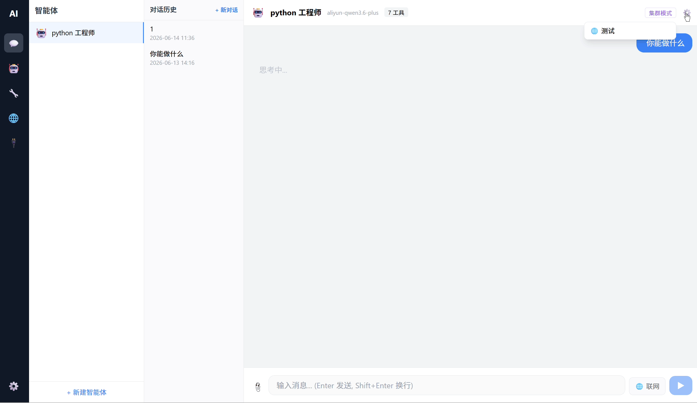
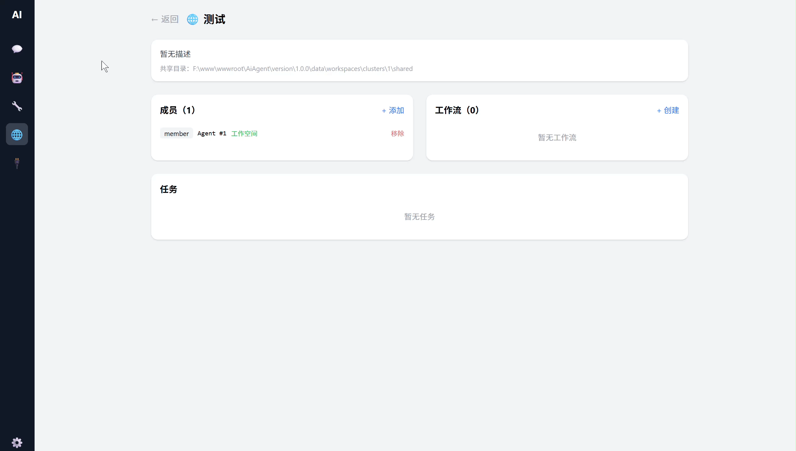

<div align="center">

# AI Agent Studio

**Desktop AI agent platform — multi-model, tool-calling, MCP support, cluster workflows.**

*FastAPI + Vue 3 + PyWebview*

[](https://python.org)
[](https://fastapi.tiangolo.com)
[](https://vuejs.org)
[](#)

[中文文档](README_CN.md)

</div>

---

A desktop AI agent platform with multi-model integration, tool calling, MCP protocol extension, and cluster collaboration. Runs as a native desktop app (PyWebview) or as a standalone web server.

---

## ⚠️ Project Status

This is a **rapid prototype (MVP)** built in 2 days to validate the product concept of a desktop AI agent platform.  
The architecture and interaction flows were independently designed; code implementation was AI-assisted with manual review for critical paths (security, permission boundaries, API key encryption).  

**Known limitations**: edge-case handling, production hardening, and comprehensive testing are still in progress.  
**Suitable for**: architecture reference, tech stack evaluation, and prototype demos.  
**Not yet suitable for**: direct production deployment without further development.

---

## Features

| Feature | Description |
|---------|-------------|
| **Agent Management** | Create, configure, and chat with agents. Custom system prompts, tool authorization, and model binding. |
| **Multi-Model Support** | OpenAI / Anthropic / DeepSeek / Ollama / Alibaba Cloud / Custom compatible APIs |
| **Tool System** | Built-in file I/O, command execution, HTTP requests, calculator, search, and more. Custom plugin support. |
| **MCP Protocol** | Connect to `stdio` and `sse` type MCP servers. Auto-discover and register remote tools. |
| **Cluster Collaboration** | Multiple agents form a cluster with shared workspaces, workflow orchestration, and task scheduling. |
| **File Processing** | Text, images, PDFs, and Office documents. Content extraction and multimodal vision support. |
| **Security** | Encrypted API Key storage, command whitelist, code sandbox, path access control. |
| **Workspace** | Per-session isolated working directories. Shared and private space isolation in cluster mode. |

## Demo

| Agent | Tools & MCP | Cluster |
|:---:|:---:|:---:|
|  |  |  |

## Tech Stack

| Layer | Technology |
|-------|------------|
| Desktop Shell | PyWebview |
| Backend | Python / FastAPI / Uvicorn / SQLAlchemy |
| Database | SQLite (auto-migration) |
| Frontend | Vue 3 / Vite / Tailwind CSS / Pinia |
| Build | PyInstaller (Windows EXE) |

## Quick Start

### Prerequisites

- Python 3.10+
- Node.js 18+
- npm

### Install Dependencies

```bash
# Backend
pip install -r requirements.txt

# Frontend
cd frontend && npm install
```

### Run

```bash
# Desktop app (Recommended)
python main.py

# Backend API only
python -m uvicorn backend.main:app --reload --port 8000

# Frontend dev server
cd frontend && npm run dev
```

### Build Executable

```bash
build_exe.bat
# Output: dist/AI Agent.exe
```

## Environment Variables

| Variable | Description | Default |
|----------|-------------|---------|
| `DATABASE_URL` | Database connection string | `sqlite:///data/app.db` |
| `ENCRYPTION_KEY` | API Key encryption key (Fernet) | Auto-generated from machine ID |
| `FRONTEND_URL` | Frontend dev server URL | Empty (use built-in static) |
| `API_VERSION` | API version prefix | `v1` |

## Project Structure

```
ai-agent-platform/
├── main.py                  # Desktop entry (PyWebview + FastAPI)
├── requirements.txt
├── ai-agent.spec            # PyInstaller config
├── build_exe.bat            # One-click build script
│
├── backend/
│   ├── main.py              # FastAPI app init
│   ├── config.py            # Global config
│   ├── database.py          # SQLAlchemy engine + auto-migration
│   ├── di.py                # Dependency injection
│   ├── security.py          # Encryption / command whitelist / sandbox
│   ├── workspace.py         # Session workspace management
│   ├── file_processor.py    # File validation, text extraction, image encoding
│   ├── models/              # SQLAlchemy models
│   ├── routers/             # API routes
│   ├── services/            # Business logic
│   └── tools_builtin/       # Built-in tools
│
├── tools_custom/            # Custom tools directory
├── plugins/                 # Plugin directory (reserved)
│
├── frontend/
│   ├── src/
│   │   ├── views/           # Page components
│   │   ├── components/      # Shared components
│   │   ├── store.js         # Pinia state management
│   │   ├── api.js           # Axios API wrapper
│   │   └── router.js        # Vue Router
│   └── vite.config.js
│
└── data/                    # Runtime data (gitignored)
```

## Custom Tools

Create Python files in `tools_custom/` and register with `@registry.register()`:

```python
from backend.services.tool_registry import registry

@registry.register(
    name="my_tool",
    description="Tool description",
    icon="🔧",
    category="Custom",
)
def my_tool(param1: str, param2: int = 0) -> str:
    """Tool logic"""
    return f"Result: {param1}"
```

Tools are auto-loaded on startup.

## MCP Servers

Add MCP servers via the management UI (supports `stdio` and `sse` types). Once enabled, tools are auto-discovered and registered with prefix `mcp_{server_name}_{tool_name}`.

## Data Storage

| Path | Description |
|------|-------------|
| `data/app.db` | SQLite database |
| `data/app.log` | Application logs |
| `data/workspaces/` | Agent workspaces |
| `data/clusters/` | Cluster shared data |

## License

MIT
